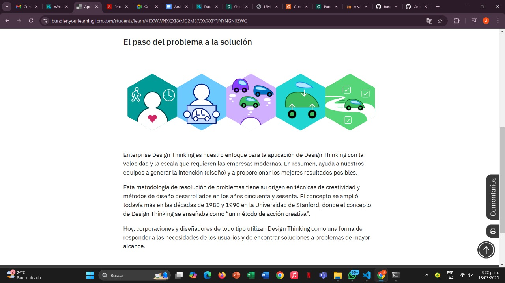
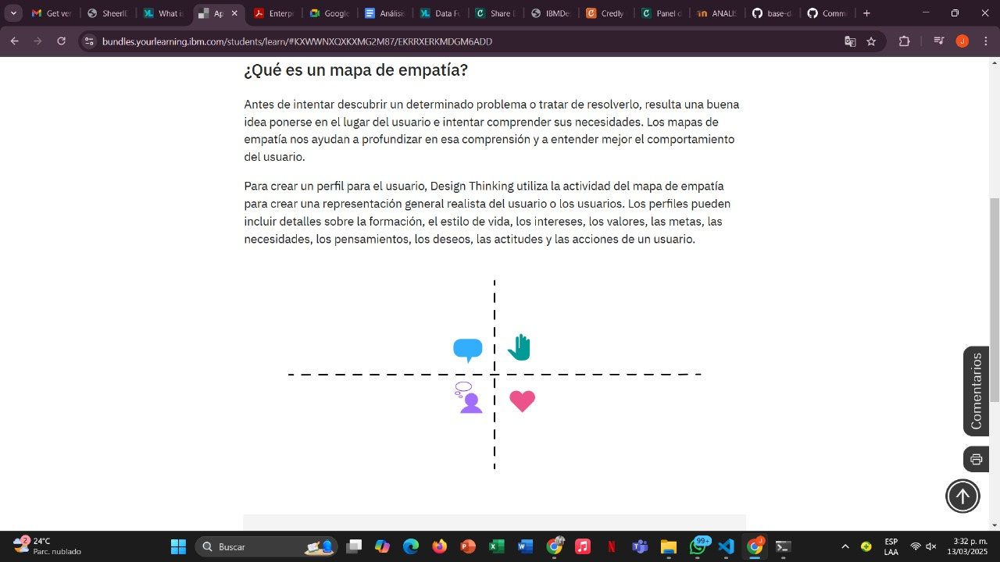
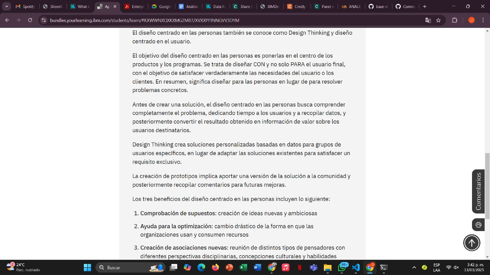
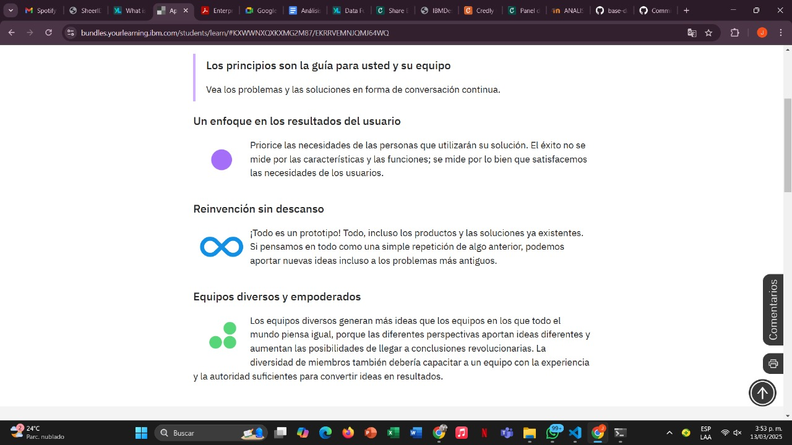
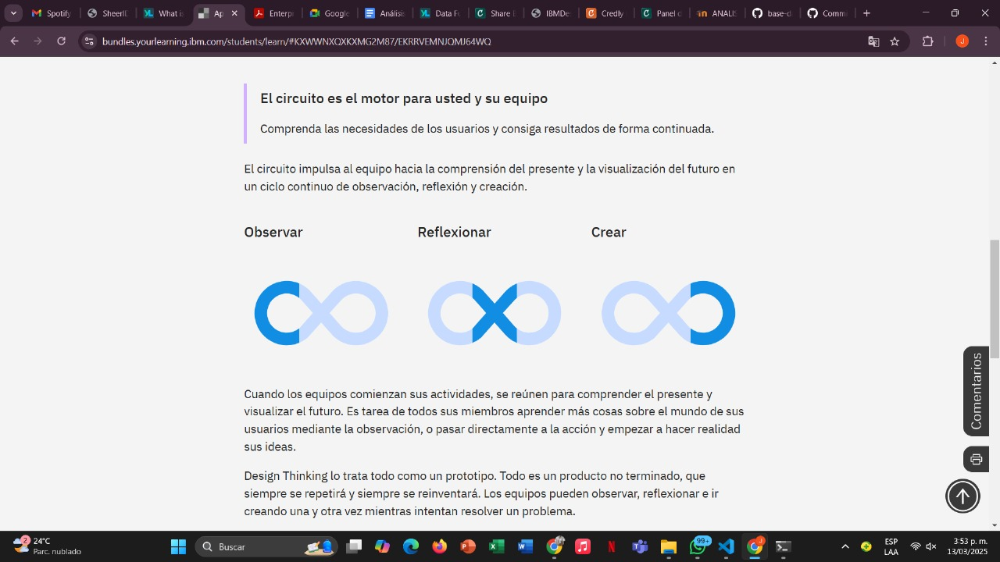
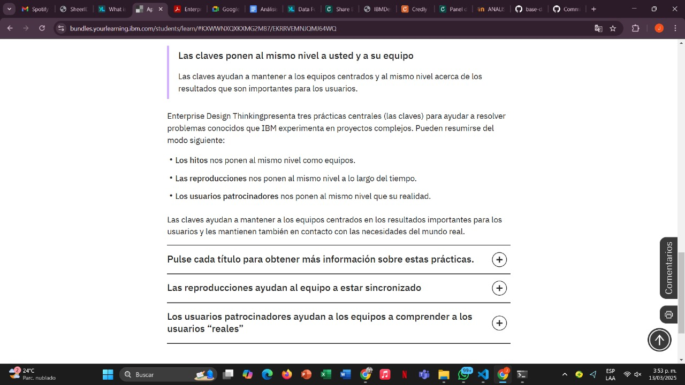
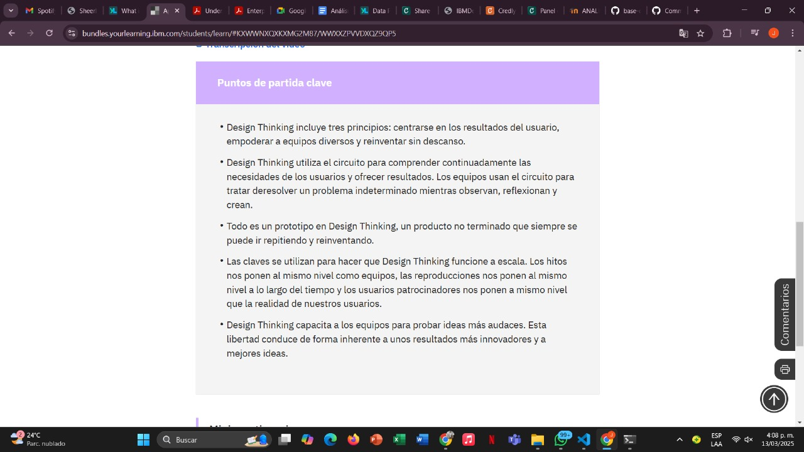

## Introduccion 

- Los problemas actuales no se resuelven de forma aislada. Los resuelven equipos diversos, que pueden actuar con mayor rapidez porque están al mismo nivel que las necesidades de las personas e invitan a los usuarios a participar de su trabajo. Equipos que observan, reflexionan y crean conjuntamente. Una y otra vez. Para proporcionar una experiencias relevantes. Enterprise Design Thinking puede conducirle a este punto. Brinda a los equipos la formación que necesitan para trabajar de una manera nueva. Y a los ejecutivos, las herramientas que necesitan para capacitar a sus equipos. Está pensado para usted, sus equipos y las personas a las que presta servicio.

## ¿Qué es Design Thinking?

- Design Thinking es una metodología para la resolución de problemas creativa. (Una “metodología” significa algo más que simplemente describir la ejecución de algo. También incluye cómo se ejecuta, y por qué.)

## ¿En qué consiste la empatía?

- La empatía es el primer paso en Design Thinking porque nos permite comprender y compartir los mismos sentimientos que sienten los demás. A través de la empatía, podemos ponernos en el lugar de otras personas y conectar con la forma en que podrían sentirse en relación con su problema, circunstancia o situación. Una gran parte de Design Thinking se centra en el impacto que el pensamiento innovador tiene en las personas.

## ¿Que es un mapa de empatia?

## El diseño centrado en el usuario

- El diseño como disciplina profesional ha experimentado una tremenda evolución, para pasar de ser una práctica centrada en el estilo estético a otra centrada en los usuarios y sus esperanzas, deseos, retos y necesidades. El “usuario” puede ser una persona o un grupo de personas que usan un producto o servicio. Al establecer empatía con el usuario, los diseñadores pueden trabajar de cara a la obtención de unos resultados que satisfagan las necesidades de manera más efectiva.

## Puntos claves

## Adopte los principios, el circuito y las claves

- Antes de profundizar demasiado en el concepto de Enterprise Design Thinking, vamos a analizar sus principios centrales, a descubrir los circuitos y a echar un vistazo a las claves.

## Design thinking 

Vamos a reunir todo el material y a ver el desarrollo de Design Thinking en acción.

En este vídeo, Mirko Azis nos habla sobre los conceptos básicos de IBM Design Thinking (ahora denominado Enterprise Design Thinking). Presenta las claves de IBM Design Thinking, los hitos, las reproducciones y los usuarios patrocinadores, y explica el concepto de circuito de diseño.

## Minicuestionario 

