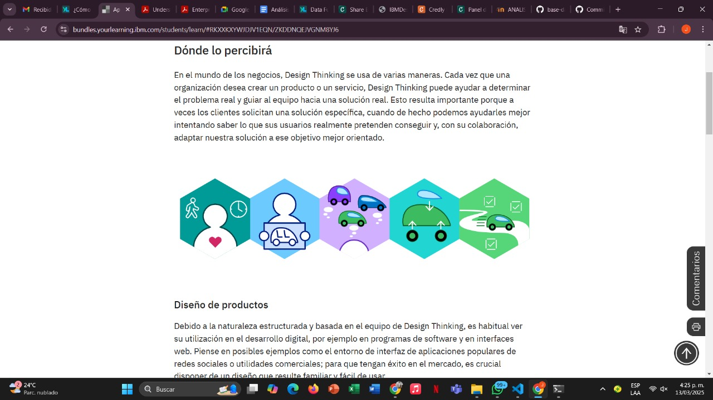
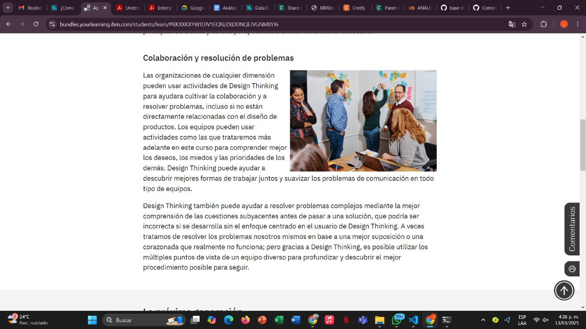
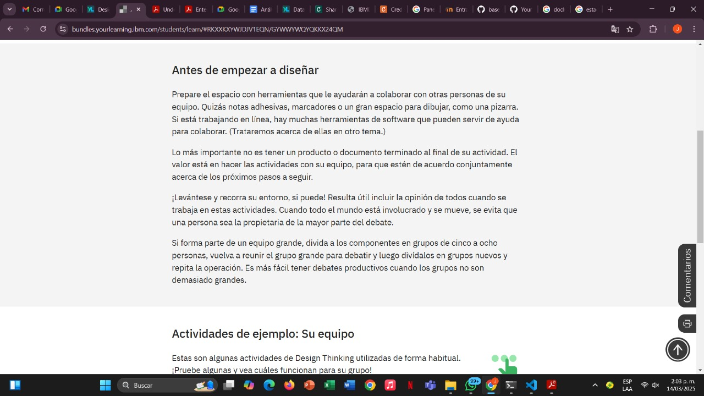
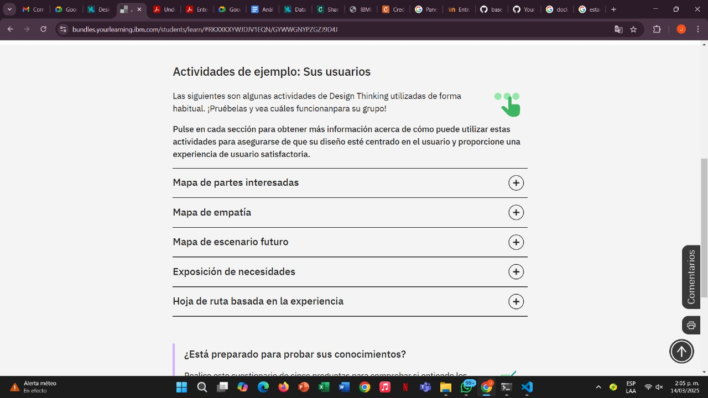
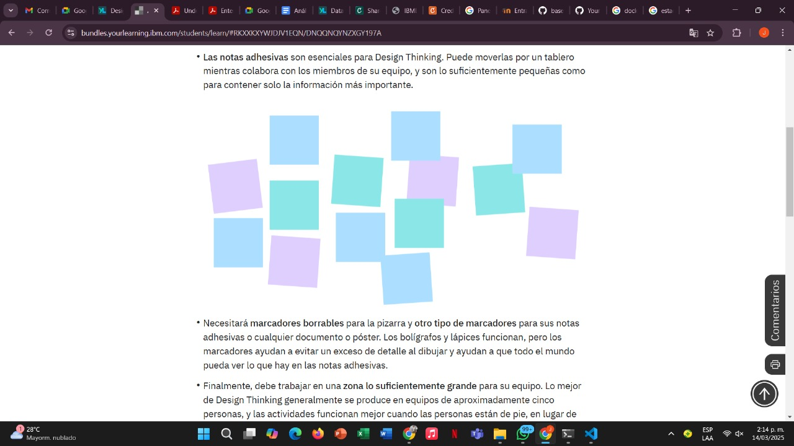
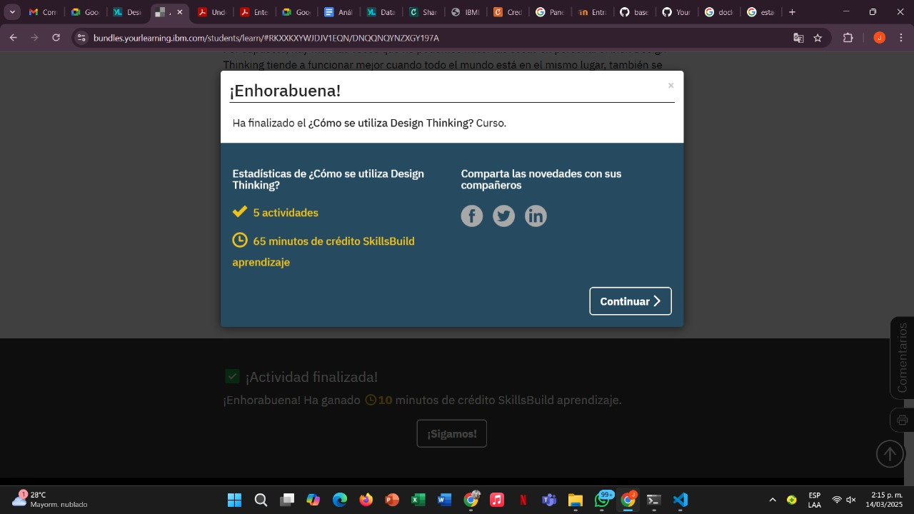

## Introduccion

- Ahora que ya le hemos presentado Design Thinking, es el momento de explorar cómofunciona en la práctica.

- En los temas siguientes, revisará los tipos de eventos que puede admitir Design Thinking, las actividades que conforman los talleres de Design Thinking y los tipos de herramientas y métodos que se utilizan en estas actividades.

## Cómo se aplica Design Thinking

## No es simplemente software
- Design Thinking no es solo para profesionales que trabajan con productos tecnológicos. Se puede usar en cualquier lugar donde múltiples personas puedan resolver los problemas. Los principios de Design Thinking (centrarse en los resultados, reinventar sin descanso y formar equipos diversos) pueden ayudar a cualquier equipo del que usted forme parte a desarrollar soluciones más claras, mejores y más útiles para más personas.

- Supongamos que su equipo deportivo quiere recaudar dinero para asistir a un torneo importante. ¿Puede ayudarle Design Thinking? Si está buscando una solución para recaudar fondos que involucre a muchas personas, trabajar en un par de actividades de Design Thinking podría ayudar a su grupo a encontrar soluciones más sólidas.

## Actividades para centrar a su equipo

- Hay muchas actividades que puede usar para ayudar a su equipo a practicar una colaboración radical y poner a las personas adecuadas (los usuarios) en el centrode su proyecto. Use estas actividades por sí mismas o como un evento mayor, considerándolas como herramientas de ayuda para explorar nuevos conceptos, crear prototipos de diseños y evaluar lo que está funcionando.

## Actividades para explorar el diseño centrado en el usuario

- Las actividades del tema anterior se centran en su equipo y en cómo trabajan juntos. Existen otras actividades de Design Thinking que permiten explorar la idea del diseño centrado en el usuario. Los usuarios pueden ser cualquier persona que se beneficie de un producto o solución; explorar quiénes son las partes interesadas y cómo puede empatizar con los usuarios y transformar las necesidades en experiencias le permitirá ofrecer un resultado final relevante.

## finalizacion de la prueba 

## Recursos y herramientas de Design Thinking

## Herramientas del oficio
- Como ha visto en los temas anteriores, hay muchas cosas que puede hacer como parte del proceso de Design Thinking, con el uso de muchas actividades útiles.

- Ahora, prepárese personalmente para el trabajo de Design Thinking con los siguientes materiales:

1. Un tablero o una pizarra grande para escribir. Debe ser lo suficientemente grande como para que todo el equipo pueda ver en qué se está trabajando, y para que varias personas puedan participar en la tablero o la pizarra a la vez. Si no tiene acceso a una superficie de escritura grande, intente usar varios carteles o rotafolios para obtener el mismo efecto.
2. Las notas adhesivas son esenciales para Design Thinking. Puede moverlas por un tablero mientras colabora con los miembros de su equipo, y son lo suficientemente pequeñas como para contener solo la información más importante.

## finalizacion del curso

