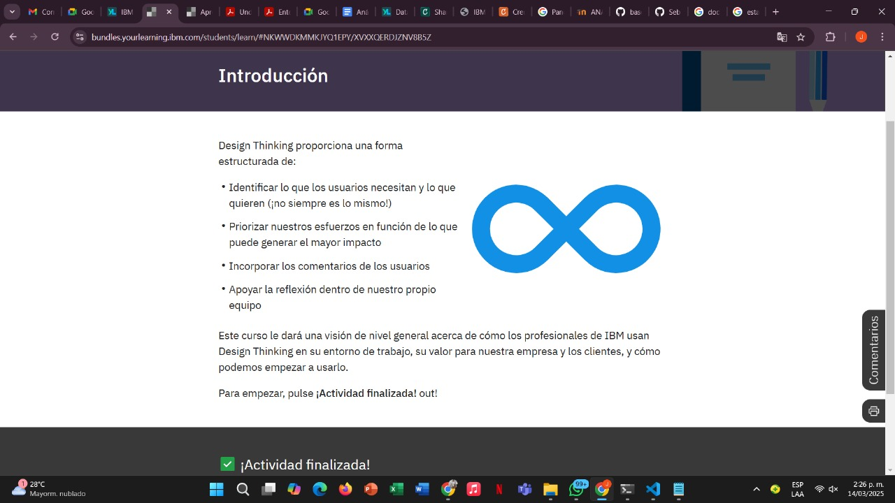
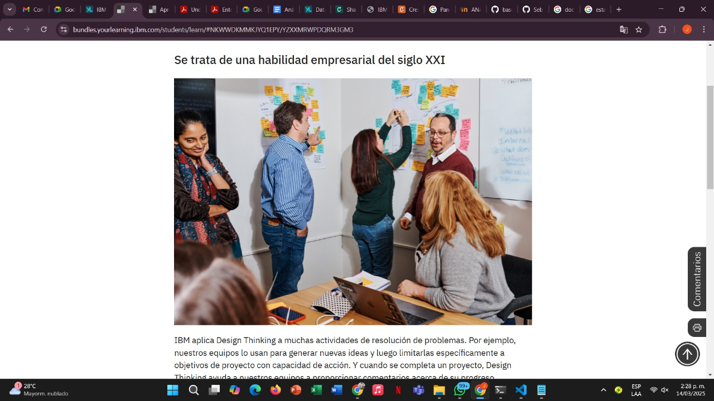
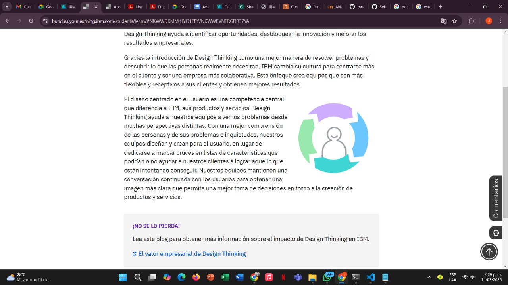
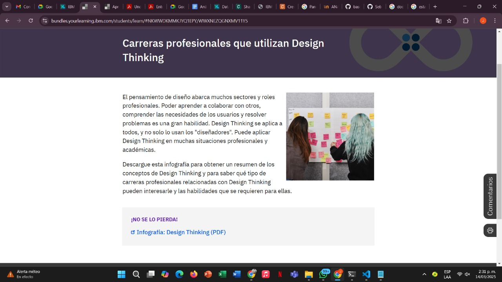
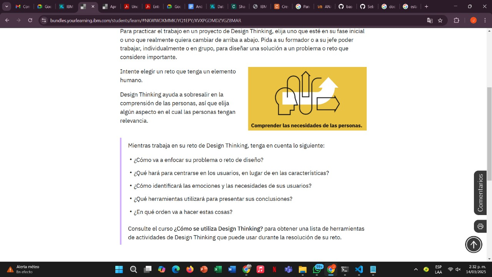
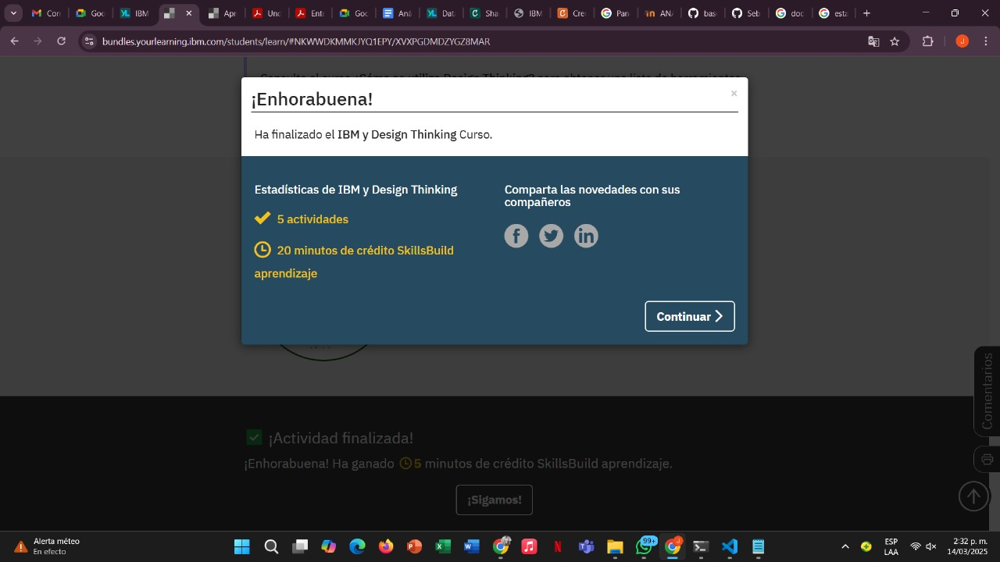

## Introduccion 

- Design Thinking proporciona una forma estructurada de:

* Identificar lo que los usuarios necesitan y lo que quieren (¡no siempre es lo mismo!)
* Priorizar nuestros esfuerzos en función de lo que puede generar el mayor impacto
* Incorporar los comentarios de los usuarios
* Apoyar la reflexión dentro de nuestro propio equipo
* Este curso le dará una visión de nivel general acerca de cómo los profesionales de IBM usan Design Thinking en su entorno de trabajo, su valor para nuestra empresa y los clientes, y cómo podemos empezar a usarlo.

## Grafica 

## Design Thinking en marcha
- IBM ha adoptado la estrategia Design Thinking para resolver los problemas de nuestros clientes de manera creativa. Nuestros consultores utilizan las sesiones de Design Thinking para reunir a diversos equipos de clientes y descubrir qué es necesario, qué es posible y qué es factible.

## El valor de Design Thinking

- Design Thinking ayuda a identificar oportunidades, desbloquear la innovación y mejorar los resultados empresariales.

Gracias la introducción de Design Thinking como una mejor manera de resolver problemas y descubrir lo que las personas realmente necesitan, IBM cambió su cultura para centrarse más en el cliente y ser una empresa más colaborativa. Este enfoque crea equipos que son más flexibles y receptivos a sus clientes y obtienen mejores resultados.

## Carreras profesionales que utilizan Design Thinking

- El pensamiento de diseño abarca muchos sectores y roles profesionales. Poder aprender a colaborar con otros, comprender las necesidades de los usuarios y resolver problemas es una gran habilidad.

## Desarrolle sus habilidades de Design Thinking

* Para practicar el trabajo en un proyecto de Design Thinking, elija uno que esté en su fase inicial o uno que realmente quiera cambiar de arriba a abajo. Pida a su formador o a su jefe poder trabajar, individualmente o en grupo, para diseñar una solución a un problema o reto que considere importante.

## Finalizacion del curso

